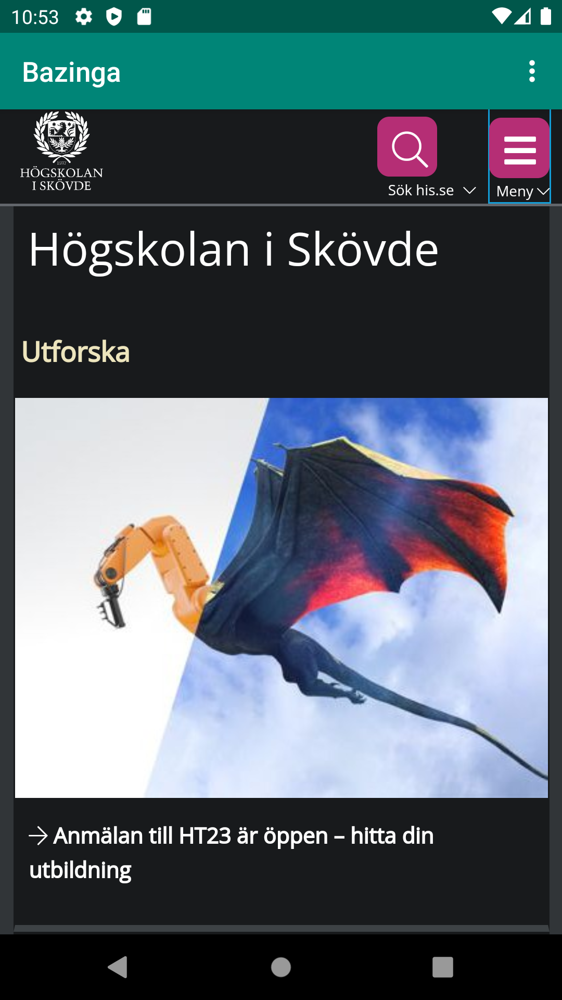
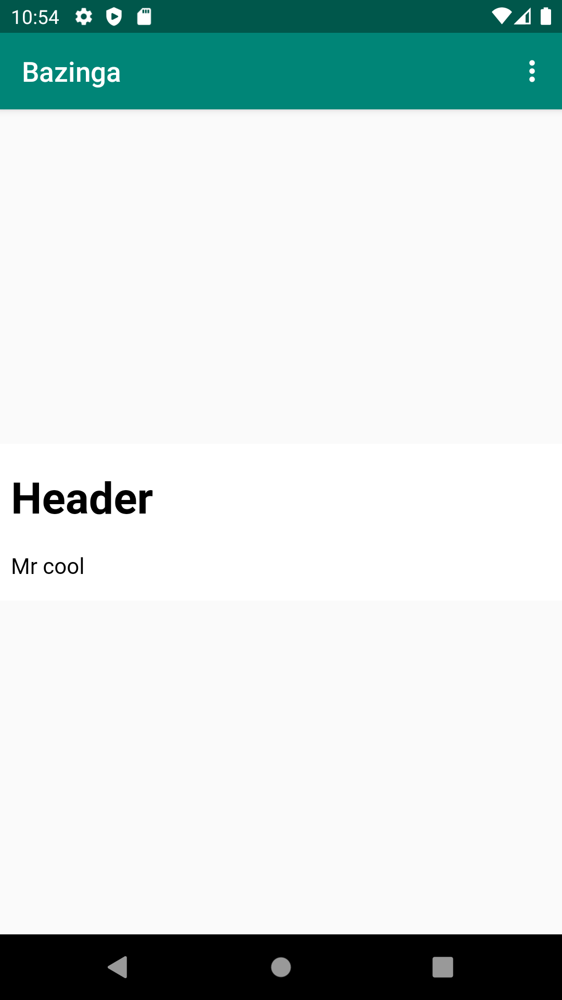

# Rapport

**Skriv din rapport här!**
Jag ändrade namnet på appen och gav appen åtkomst till internet så att appen skall kunna komma åt en url som implementerades senare.
Sedan skapade jag en WebView som agerar som en container till hemsidan och den egenskrivna html koden.
WebViewClient hanterar vad som ska visas i WebView. 
Efter det definierade jag funktionerna till internal och external webpage.
En html fil skapades även:
```
<!DOCTYPE html>
<html>
    <head>
        <title>Webpage</title>
    </head>
    <body>
        <h1>
            <strong>Header</strong>
        </h1>
        <p>Mr cool</p>
    </body>
</html>
```
Sedan länkade jag funktionerna till knapparna i appen.






